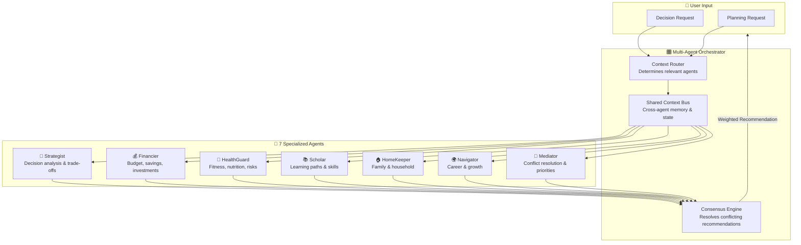
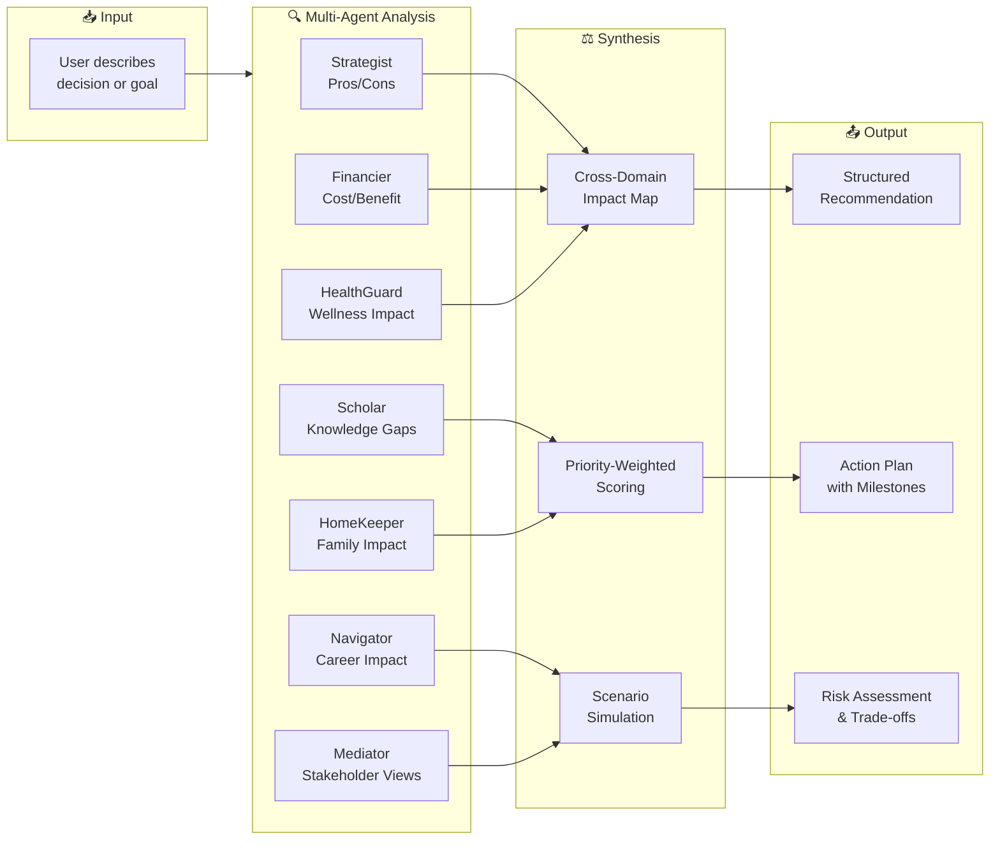
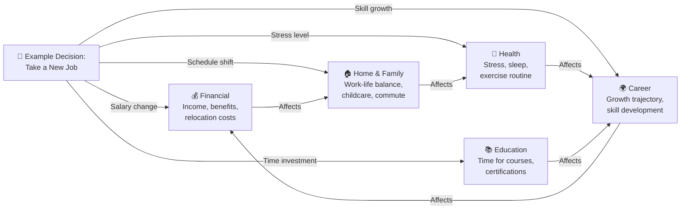
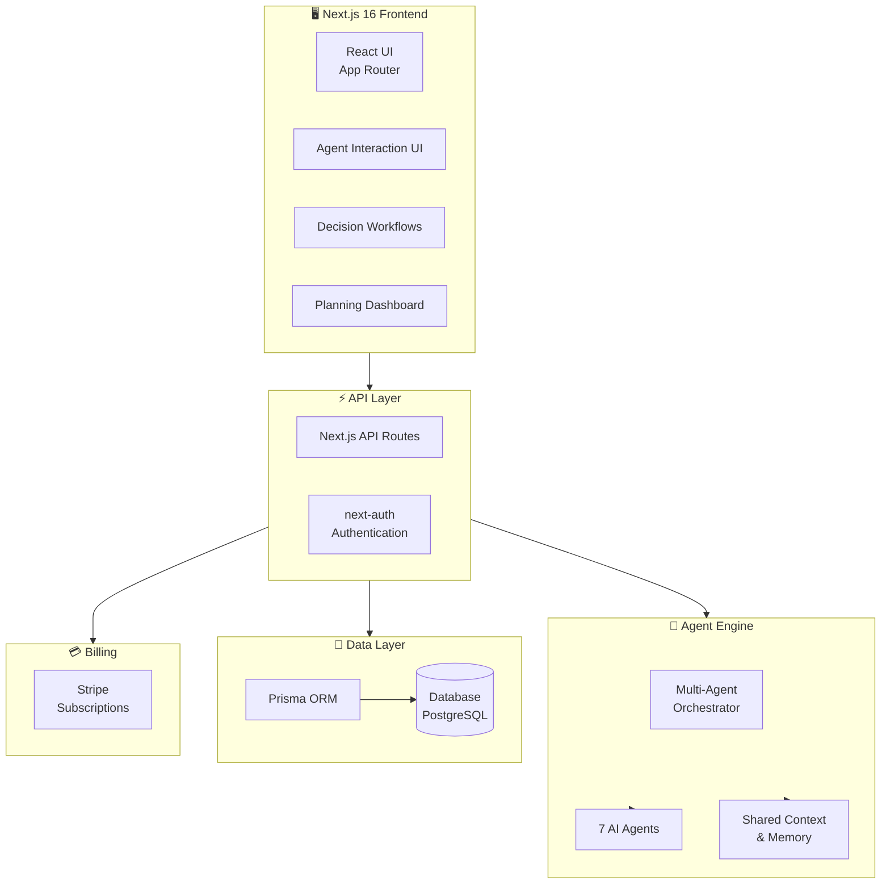

<!-- BANNER -->


<!-- TYPING SVG -->
<div align="center">
  <a href="https://git.io/typing-svg">
    
  </a>
</div>

<br/>

<!-- BADGES -->
<div align="center">

[](https://www.typescriptlang.org/)
[](https://nextjs.org/)
[](https://github.com/mulkymalikuldhrs/famlyzer-ai)
[](./LICENSE)

</div>

---

## Overview

**Famlyzer AI** is a decision and planning intelligence platform powered by 7 specialized AI agents working in concert. Each agent focuses on a different domain of life planning — from financial decisions and career moves to family scheduling and health goals. Together, they provide holistic, context-aware recommendations that consider the interconnected nature of real-life decisions.

Built with TypeScript and Next.js, Famlyzer AI transforms complex multi-domain decisions into structured, actionable plans while keeping humans firmly in the driver's seat.

## Features

### 7 Specialized AI Agents

| Agent | Domain | Focus |
|-------|--------|-------|
| 🧠 **Strategist** | Decision Analysis | Breaks down complex decisions, evaluates trade-offs |
| 💰 **Financier** | Financial Planning | Budget analysis, savings goals, investment considerations |
| 🏥 **HealthGuard** | Health & Wellness | Fitness goals, nutrition planning, health risk awareness |
| 📚 **Scholar** | Education & Skills | Learning paths, skill development, knowledge gaps |
| 🏠 **HomeKeeper** | Family & Home | Scheduling, household management, family coordination |
| 🌍 **Navigator** | Career & Growth | Career moves, professional development, opportunities |
| 🤝 **Mediator** | Conflict Resolution | Interpersonal decisions, compromise suggestions, priorities |

### Multi-Agent Orchestration
- Agents communicate and share context across domains
- Cross-domain impact analysis (e.g., how a career move affects family and finances)
- Consensus-building when agents disagree on recommendations
- Priority-weighted decision scoring

### Decision Workflows
- Structured decision-making frameworks (pros/cons, weighted scoring, scenario analysis)
- Timeline-based planning with milestone tracking
- What-if scenario simulation
- Decision journal with outcomes tracking

### Planning & Organization
- Goal setting with SMART criteria
- Action plan generation with dependencies
- Calendar integration and scheduling
- Progress tracking and plan adjustments

### Collaboration
- Multi-user family accounts
- Shared decision spaces
- Role-based agent interaction
- Exportable plans and reports

## Honest Notes

> **Important context about Famlyzer AI:**

- **Suggestions, Not Professional Advice** — AI recommendations are suggestions to consider, not professional financial, medical, legal, or career advice. Always consult qualified professionals for important decisions.
- **AI Limitations** — The agents operate within the bounds of their training data and may not account for unique personal circumstances, local regulations, or recent changes in markets/policies.
- **No Guarantee of Outcomes** — Following AI recommendations does not guarantee positive results. Life decisions involve factors beyond any AI's ability to predict.
- **Privacy Considerations** — The platform processes personal and potentially sensitive information. Review the privacy policy and understand how your data is used.
- **Human Judgment is Essential** — Famlyzer AI is a thinking tool, not a decision maker. The best outcomes come from combining AI insights with human wisdom and professional guidance.

## Quick Start

### Prerequisites
- Node.js 18+
- API keys for LLM provider(s)

### Installation

```bash
# Clone the repository

<!-- AUTO-PACKAGE-BADGES:START -->

<!-- AUTO-PACKAGE-BADGES:END -->
git clone https://github.com/mulkymalikuldhrs/famlyzer-ai.git
cd famlyzer-ai

# Install dependencies
npm install

# Configure environment
cp .env.example .env
```

### Configuration

```env
# LLM Provider
OPENAI_API_KEY=your_key
# or
ANTHROPIC_API_KEY=your_key

# App
NEXT_PUBLIC_APP_URL=http://localhost:3000
DATABASE_URL=your_database_url
```

### Running

```bash
# Development
npm run dev

# Production
npm run build && npm start
```

## Project Structure

```
famlyzer-ai/
├── src/
│   ├── app/                # Next.js app router
│   ├── components/
│   │   ├── agents/         # Agent interaction UI
│   │   ├── decisions/      # Decision workflow views
│   │   ├── plans/          # Planning dashboard
│   │   └── shared/         # Common components
│   ├── lib/
│   │   ├── agents/         # 7 AI agent definitions
│   │   ├── orchestration/  # Multi-agent coordination
│   │   ├── workflows/      # Decision workflow engine
│   │   └── planning/       # Planning & scheduling
│   └── types/              # TypeScript definitions
├── prompts/                # Agent system prompts
└── tests/                  # Test suites
```

## Visual Architecture

> Interactive Mermaid diagrams — viewable on GitHub. These illustrate the multi-agent system design and data flow at a glance.

### 7-Agent Orchestration



### Decision Workflow



### Cross-Domain Impact



### SaaS Architecture



## Contributing

1. Fork the repository
2. Create a feature branch (`git checkout -b feature/agent-improvement`)
3. Add tests for new functionality
4. Submit a pull request with clear description

Areas of special interest:
- New agent specializations
- Better cross-domain reasoning
- Localization and accessibility
- Decision framework implementations

## Disclaimer

Famlyzer AI provides AI-generated suggestions for personal decision-making and planning. These suggestions are **not** professional financial, medical, legal, career, or any other form of professional advice. Always consult with qualified professionals before making important life decisions. The authors assume no liability for decisions made based on AI-generated recommendations.

## License

This project is licensed under the **MIT License** — see the [LICENSE](./LICENSE) file for details.

## Author

<div align="center">

**Mulky Malikul Dhaher**

[](https://github.com/mulkymalikuldhrs)
[](mailto:mulkymalikudhr@mail.com)

</div>

---

<!-- FOOTER BANNER -->

